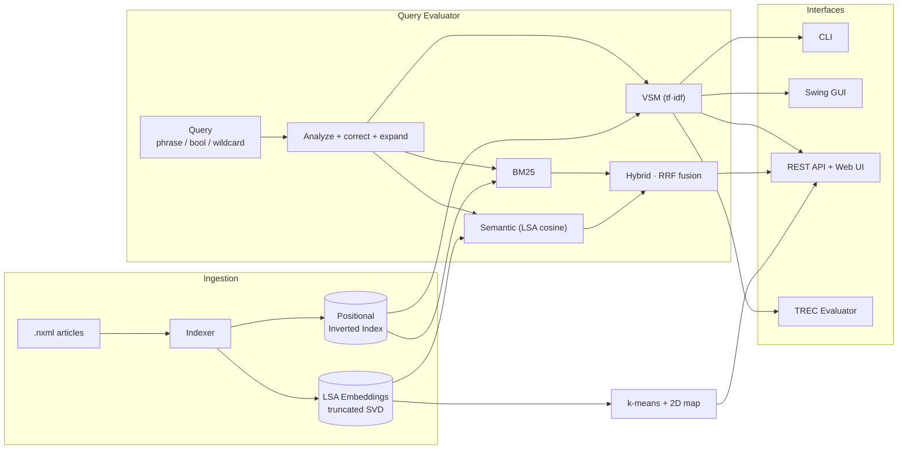

# MedIR — Clinical Information Retrieval Engine


MedIR is a full-stack information retrieval system for clinical medical literature. It builds a **positional inverted index** over a collection of PubMed Central articles and ranks them with **four retrieval models** — including a **Latent Semantic Analysis (LSA) engine implemented from scratch** (truncated SVD, no ML libraries) and a **hybrid lexical+semantic ranker** fused via Reciprocal Rank Fusion.

Retrieval is exposed through four interfaces: an interactive **CLI**, a desktop **Swing GUI**, a **REST API with a browser search UI** (autocomplete, snippet highlighting, and an interactive latent-space document map), and a batch **TREC evaluation pipeline**. The whole system is containerized with a multi-stage **Docker** build, validated in **GitHub Actions CI**, and documented with an **OpenAPI 3.0** spec.

Built on the TREC Clinical Decision Support track dataset — three clinical query types: *diagnosis*, *test*, *treatment*.

---

## Highlights

- **LSA semantic search from scratch** — dense document embeddings from a truncated SVD (NIPALS power iteration with residual deflation), with correct query fold-in (`A·V = U·Σ`). No NumPy, no external linear-algebra library — pure Java.
- **Hybrid retrieval** — combines BM25 (lexical) and LSA (semantic) rankings with **Reciprocal Rank Fusion** (RRF, k=60) for robustness across query types.
- **Unsupervised document map** — spherical k-means clustering over the latent embeddings, projected to a 2D map and rendered as an interactive SVG scatter plot in the web UI.
- **Four ranking models, head-to-head** — VSM, BM25, LSA, and Hybrid, all measured with a TREC-style evaluation harness (MAP, P@K, R@K, NDCG, R-Prec).
- **Production-shaped delivery** — REST API, OpenAPI spec, multi-stage Docker image with a health check, GitHub Actions CI, and a dependency-free test suite (23 tests).
- **Classic IR done right** — phrase / boolean / proximity / wildcard queries, Rocchio pseudo-relevance feedback, Levenshtein spelling correction, prefix autocomplete, and document-similarity search.

---

## Architecture



---

## Retrieval Models

| Model | How it ranks | Notes |
|-------|--------------|-------|
| **VSM** | tf·idf cosine similarity over the sparse term-document space | Classic vector space baseline |
| **BM25** | Probabilistic relevance (k1 = 1.5, b = 0.75) with document-length normalization | Lexical baseline |
| **Semantic (LSA)** | Cosine similarity in a dense latent space from truncated SVD | Captures synonymy / topical relevance the bag-of-words models miss |
| **Hybrid** | Reciprocal Rank Fusion of BM25 + LSA (k = 60) | Robust blend of lexical precision and semantic recall |

### Evaluation results

Measured on the MiniCollection (54 documents, 6 TREC topics), top-10, via `dist/evaluator.jar --model all`:

| Model        | MAP        | P@10   | NDCG@10    | R-Prec     |
|--------------|------------|--------|------------|------------|
| VSM          | 0.7268     | 0.5167 | 0.8043     | 0.7083     |
| BM25         | 0.5509     | 0.4667 | 0.6987     | 0.5417     |
| **Semantic (LSA)** | **0.7564** | 0.5167 | **0.8237** | **0.7500** |
| Hybrid (RRF) | 0.6854     | 0.5000 | 0.7964     | 0.6250     |

The from-scratch **LSA model achieves the best MAP, NDCG@10, and R-Prec**, outperforming both lexical baselines — the dense latent representation recovers relevant documents that share topic but not exact terms. BM25's aggressive length normalization penalizes the longer (and more relevant) clinical articles on this small corpus, which is why VSM leads it here; on larger collections the gap typically narrows or reverses.

---

## Quick Start

### Docker (recommended)

```bash
docker compose up --build
```

The image compiles the sources, **builds the index and LSA embeddings inside the container** (so stored document paths match the container filesystem), and serves the search UI at <http://localhost:8080>. A `HEALTHCHECK` polls `/health`.

### Local build (JDK 21+)

No Maven or Gradle required — just the JDK and the two bundled jars (`src/libs/BioReader.jar`, `src/libs/Stemmer.jar`).

```bash
# Linux / macOS
./build.sh
# Windows / PowerShell
./build.ps1
```

This compiles everything to `out/` and packages five runnable jars into `dist/`.

---

## Usage

**1. Build the index + embeddings** (run this first)

```bash
java -jar dist/indexer.jar
```

Reads `.nxml` files from `dataset/clinic/` and writes the positional inverted index, document store, and **LSA embeddings** (`EmbeddingsFile.txt`, `LatentTermsFile.txt`) to `CollectionIndex/`.

**2. Query — CLI**

```bash
java -jar dist/queryevaluator.jar [--model bm25|vsm|semantic|hybrid] [--topk N] [--type diagnosis|test|treatment]
```

Phrase queries with `"quotes"`, boolean `AND/OR/NOT`, `prefix*` wildcards, `"a b"~N` proximity, and `+`-prefixed Rocchio expansion are all supported.

**3. Query — Swing GUI**

```bash
java -jar dist/queryevaluatorgui.jar
```

Pick a model and query type from the toolbar, toggle **Expand** for Rocchio feedback, and click any result for the full title, highlighted abstract, and metadata.

**4. REST API + Web UI**

```bash
java -jar dist/server.jar      # http://localhost:8080
```

The browser UI adds autocomplete, `<mark>`-highlighted snippets, a "did you mean?" prompt for misspelled terms, a similar-docs modal, CSV export, and an **interactive document map** (SVG scatter plot of the latent space, colored by cluster).

**5. Evaluate retrieval quality**

```bash
java -jar dist/evaluator.jar [--model vsm|bm25|semantic|hybrid|both|all]
```

`both` runs VSM + BM25; `all` runs all four models with a side-by-side comparison table. Writes per-topic metrics, a TREC run file, and qrels to `doc/`.

---

## REST API

| Endpoint | Description |
|----------|-------------|
| `GET /search?q=...&model=...&type=...&topk=...&expand=true` | Ranked retrieval (BM25 / VSM / semantic / hybrid) |
| `GET /suggest?prefix=...` | Autocomplete — vocabulary terms by prefix, ranked by df |
| `GET /similar?pmcid=...&topk=N` | Documents most similar to a given article |
| `GET /map?clusters=N` | 2D latent-space document map + k-means cluster keywords |
| `GET /stats` | Index statistics (vocabulary size, doc count, top terms) |
| `GET /health` | Liveness + index/semantic-model status (JSON) |
| `GET /openapi.yaml` | Machine-readable OpenAPI 3.0 specification |

Full request/response schemas are in [`openapi.yaml`](openapi.yaml).

---

## Advanced Features

### Latent Semantic Analysis (from scratch)
A term-document tf·idf matrix is decomposed with a **truncated SVD** computed by NIPALS power iteration with residual deflation (deterministic seed, convergence 1e-6). Documents are stored as dense vectors `D = A·V`; queries fold into the same space via `q = Σ xₜ · Vₜ`, so documents and queries are directly comparable by cosine. Ranking, the document map, and clustering all read these embeddings.

### Hybrid Retrieval (Reciprocal Rank Fusion)
BM25 and LSA each rank a candidate pool; their ranks are fused with `score(d) = Σ 1 / (k + rankᵢ(d))`, k = 60. RRF needs no score normalization and is robust to the two models' very different score scales. Falls back to BM25 if embeddings are unavailable.

### Document Map & Clustering
**Spherical k-means** partitions the latent embeddings into 2–8 clusters; each cluster is labeled with its most characteristic stems. The embeddings are projected to 2D and served to the web UI as an interactive, cluster-colored SVG scatter plot — click a point to find similar documents.

### Phrase / Boolean / Proximity / Wildcard Queries
`"chest pain"` (exact adjacent positions via the positional index), `A AND/OR/NOT B`, `"a b"~N` (within N tokens), and `cardio*` (prefix wildcard).

### Rocchio Pseudo-Relevance Feedback
The top-3 results seed feedback; terms scored by `tf × idf` contribute the top-5 unseen terms back into the query before re-ranking.

### Spelling Correction & Autocomplete
Out-of-vocabulary stems are matched to known terms by **prefix-constrained Levenshtein** (≤ 2) and substituted transparently (surfaced as `oov` in the API). `/suggest` returns prefix matches ranked by document frequency, debounced on every keystroke in the UI.

### Document Similarity
`/similar?pmcid=…` extracts informative terms (1 < df < N) from a document's title and abstract and runs a BM25 search excluding the source.

### Design Pattern — Proxy
`CachingQueryEngineProxy` wraps `RealQueryEngine` (`IQueryEngine`) and memoizes results by `(stems, type, topK)`, avoiding redundant I/O when the same topic is evaluated across multiple models.

---

## Tech Stack & DevOps

- **Language:** Java 21+ (pure standard library; runtime has **zero external dependencies** beyond the two bundled academic jars).
- **HTTP:** `com.sun.net.httpserver.HttpServer` with an inline HTML/CSS/JS single-page UI (SVG visualization).
- **Containerization:** multi-stage `Dockerfile` (JDK build stage → slim JRE runtime stage) + `docker-compose.yml`, with a `/health` `HEALTHCHECK`.
- **CI:** GitHub Actions — compiles, runs the test suite, builds the index, runs the four-model evaluation, and builds the Docker image on every push/PR.
- **API contract:** OpenAPI 3.0.3 spec, served live at `/openapi.yaml`.
- **Testing:** 23 dependency-free assertions (`queryeval.TestRunner`) covering vector math, edit distance, RRF fusion, evaluation metrics, and the full LSA pipeline (SVD rank, query fold-in, save/load round-trip, k-means separation).

```bash
java -cp "out;src/libs/BioReader.jar;src/libs/Stemmer.jar" queryeval.TestRunner   # 23/23 pass
```

---

## Project Structure

```
src/
  indexer/        positional, length-aware inverted index builder + LSA embedding generation
  queryeval/      VSM, BM25, LSA (SemanticModel), hybrid RRF, phrase/Rocchio search,
                  Swing GUI, REST server, TREC evaluator, test runner
  libs/           BioReader.jar, Stemmer.jar (bundled)
dist/             five runnable jars (indexer, queryevaluator, queryevaluatorgui, evaluator, server)
CollectionIndex/  generated index + embeddings (created by the indexer)
dataset/          MiniCollection — 54 documents
Stopwords/        English + Greek stopword lists
topics.xml        TREC-style topic definitions
openapi.yaml      OpenAPI 3.0 specification
Dockerfile / docker-compose.yml
.github/workflows/ci.yml
```

---

## Résumé bullet points

- Implemented **Latent Semantic Analysis from scratch** in pure Java — truncated SVD via NIPALS power iteration with deflation — producing dense document embeddings that **beat tf·idf and BM25 baselines on MAP, NDCG, and R-Precision**.
- Built a **hybrid retrieval pipeline** fusing lexical (BM25) and semantic (LSA) rankings with **Reciprocal Rank Fusion**, plus spherical **k-means clustering** and a 2D **latent-space document map** with an interactive SVG visualization.
- Shipped a **REST API** (`com.sun.net.httpserver`) with an **OpenAPI 3.0** contract, a browser search UI, **multi-stage Docker** packaging with a health check, **GitHub Actions CI**, and a **dependency-free test suite** (23 tests) — no Maven/Gradle, zero runtime dependencies.
- Engineered a **positional inverted index** supporting phrase, boolean, proximity, and wildcard queries, **Rocchio** pseudo-relevance feedback, **Levenshtein** spelling correction, prefix autocomplete, and document-similarity search.

---

*University of Crete · CS-463 Information Retrieval · group 5241 / 5064 / 1497*
